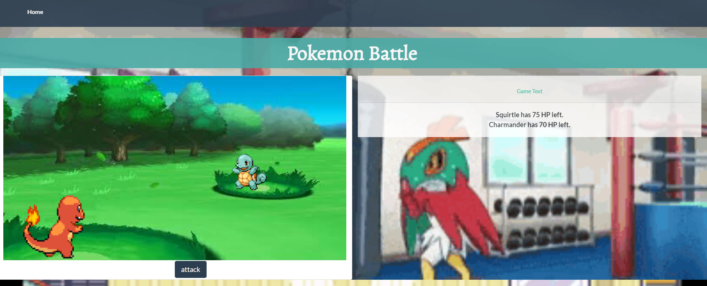

# Pokemon Battler!

The Pokemon Battler application was developed as a part of UCSDs Full-Stack Coding Bootcamp. It is a play off of the classic
Pokemon games and allows multiple users to connect to the same unique match rooms by id and participate in a turn-based
Pokemon battle.

Languages and Tools:
HTML, CSS, Javascript, jQuery, MySql, Heroku, Express.js, Node.js, Socket.io

How to play!: 
1) Player 1: Hit the "New User?" link on navigation bar to create a unique username.
    - Navigate to the next page using the "Ready to Battle" link in the navigation bar.
    - Select your username from the dropdown menu, and create your match room.
    - Send the room id provided in the game text box to your friend.
2) Player 2: Navigate straight to the "Ready to Battle" page using the link in the navigation bar
    - Type a unique username in the input box.
    - Provide the room id given to you by Player 1
    - Join the match
3) CLick "Attack" when it is your turn until a winner is decided!

Play the deployed version: [Heroku App](https://pokemongame-cbc.herokuapp.com/)
Link to the github repo: [GitHub Repo](https://github.com/nguyenj0215/Pokemon-Battler)